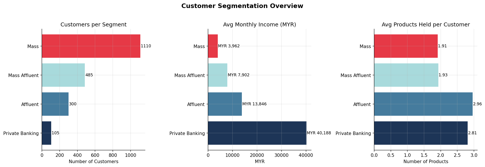
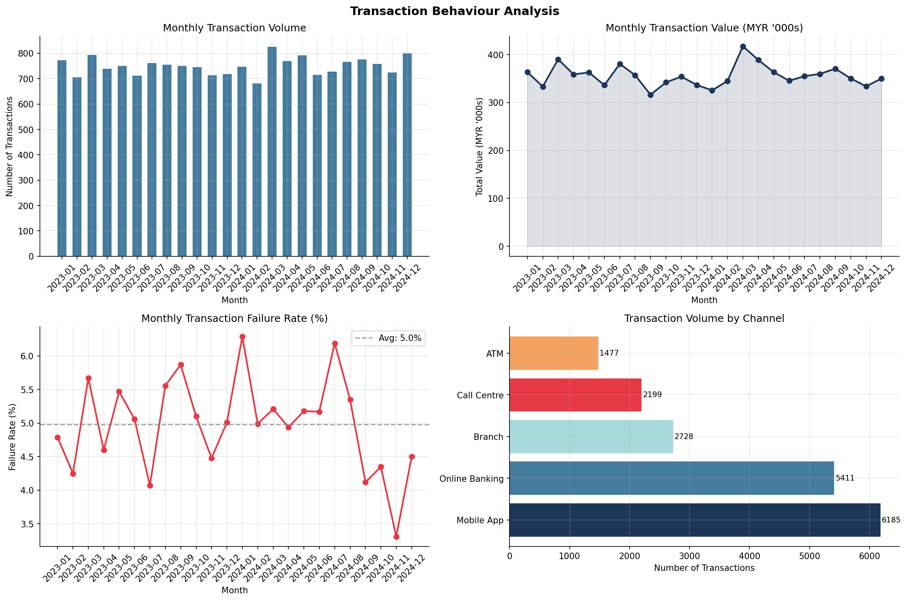
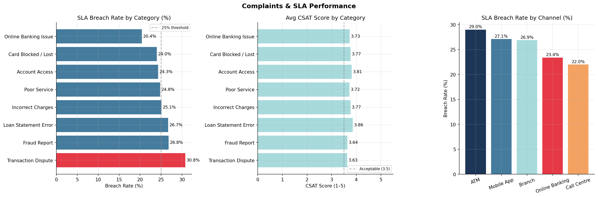
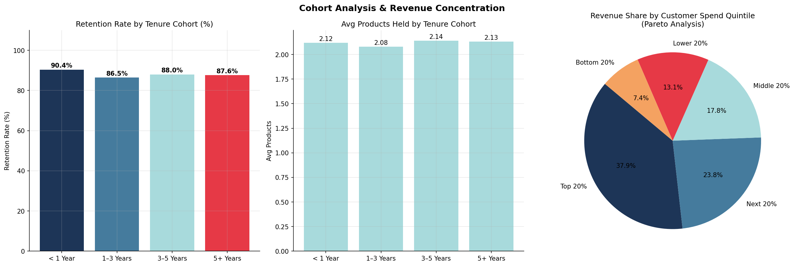
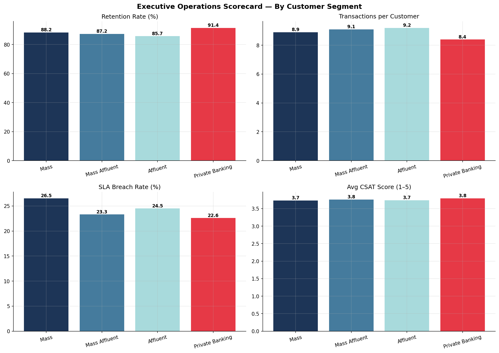

# 🏦 Retail Banking Operations Analytics — End-to-End SQL Case Study

> *An end-to-end SQL case study simulating retail banking operations, designed to deliver business insights across customer segmentation, transaction behaviour, service performance, and operational risk.*

> ⚡ Built to mirror real-world banking analytics workflows — from raw data to executive decision-making.

---

## 📌 Project Overview

This project simulates how a banking analytics team would analyse customer behaviour, transaction activity, and service performance to support operational and strategic decision-making. Using a synthetic dataset modelled after Southeast Asian financial institutions, the analysis demonstrates how SQL can be used to deliver end-to-end business insights across multiple operational domains.

1. **Who are our customers?** — Segmentation, demographics, and portfolio distribution
2. **How are transactions behaving?** — Volume trends, channel mix, failure rates, and high-value flags
3. **How well do we resolve complaints?** — SLA breach rates, CSAT trends, and escalation risk
4. **Are we retaining customers?** — Cohort analysis, dormancy detection, and revenue concentration
5. **Which products are working?** — Penetration rates, complaint-to-transaction ratios, and segment affinity
6. **What is the bank's overall health?** — A composite executive scorecard across all dimensions

---

## 💼 Why This Project Matters

Retail banks operate across multiple dimensions — customer growth, transaction reliability, service quality, and risk management.

This project demonstrates how a BI analyst would:
- Identify revenue opportunities through customer segmentation and product penetration
- Detect operational risks via transaction anomalies and complaint patterns
- Monitor service performance using SLA compliance and CSAT trends
- Deliver executive-level insights through a unified KPI scorecard

The goal is to show how raw operational data can be transformed into actionable insights for decision-making at both operational and leadership levels.

---

## 🗂️ Dataset

All data is synthetically generated using Python (`Faker`, `NumPy`, `Pandas`) and saved as both **CSV files** and a **SQLite database** (`banking.db`).

### Schema — 5 Relational Tables

```
customers (2,000 rows)
├── customer_id        PK
├── customer_segment   [Mass | Mass Affluent | Affluent | Private Banking]
├── state              [10 Malaysian states]
├── age, gender, monthly_income_myr
├── products_held      (pipe-delimited product IDs)
├── num_products, account_tenure_days, is_active
└── account_open_date

products (10 rows)
├── product_id         PK
├── product_name, product_category
├── min_balance, interest_rate, annual_fee
└── [Savings | Deposit | Loan | Card | Current | Digital]

transactions (18,000 rows)
├── transaction_id     PK
├── customer_id        FK → customers
├── product_id         FK → products
├── transaction_date, transaction_month
├── transaction_type   [Purchase | Transfer | Bill Payment | Withdrawal | Refund | Top-Up]
├── amount_myr, channel, status
└── [Successful | Failed | Reversed]

complaints (1,200 rows)
├── complaint_id       PK
├── customer_id        FK → customers
├── product_id         FK → products
├── complaint_category, filed_date, resolved_date
├── resolution_days, sla_target_days, sla_breached
├── channel, status, csat_score (1–5)
└── [8 complaint categories]

sla_targets (8 rows)
├── complaint_category PK
├── sla_target_days
└── priority           [High | Medium | Low]
```

**Entity Relationship:**

```
customers ──< transactions >── products
customers ──< complaints  >── products
complaints >── sla_targets
```

---

## 🛠️ Tools & Techniques

| Tool | Purpose |
|------|---------|
| **SQL (SQLite)** | Core analysis — all business questions answered via SQL |
| **Python** | Dataset generation (`Faker`, `NumPy`), visualisation (`Matplotlib`, `Seaborn`) |
| **Pandas** | Query result handling and display |
| **Git / GitHub** | Version control and project hosting |

### SQL Techniques Demonstrated

| Technique | Where Used |
|-----------|-----------|
| `CTEs` (Common Table Expressions) | All query files; up to 5-level chain in Query 06 |
| `Window Functions` | `RANK`, `NTILE`, `LAG`, `SUM OVER`, `AVG OVER PARTITION BY` |
| `Multi-table JOINs` | 4-table joins in executive scorecard |
| `Conditional Aggregation` | `SUM(CASE WHEN ...)` throughout |
| `Date Arithmetic` | `julianday()`, `strftime()`, tenure calculations |
| `Subqueries` | Inline and correlated subqueries |
| `COALESCE / NULLIF` | Null handling in LEFT JOINs |
| `LIKE` pattern matching | Product holding detection on denormalised column |
| `Composite Scoring` | Multi-dimension KPI scorecard in Query 06 |

---

## 📁 Project Structure

```
banking_sql_project/
│
├── data/
│   ├── generate_dataset.py       ← Synthetic data generator (reproducible, seed=42)
│   ├── banking.db                ← SQLite database (all 5 tables)
│   ├── customers.csv
│   ├── transactions.csv
│   ├── complaints.csv
│   ├── products.csv
│   └── sla_targets.csv
│
├── sql_queries/
│   ├── 01_customer_segmentation.sql   ← Segment distribution, age bands, tenure cohorts
│   ├── 02_transaction_analysis.sql    ← Monthly trends, MoM change, channel mix, risk flags
│   ├── 03_complaints_sla.sql          ← SLA breach rates, CSAT, customer risk scorecard
│   ├── 04_cohort_retention.sql        ← Cohort retention, dormancy, Pareto analysis
│   ├── 05_product_performance.sql     ← Product adoption, complaint ratios, segment affinity
│   └── 06_executive_scorecard.sql     ← 5-CTE executive scorecard + monthly KPI dashboard
│
├── notebooks/
│   └── analysis.py                   ← Runs all SQL + generates charts
│
├── assets/
│   ├── 01_customer_segmentation.png
│   ├── 02_transaction_analysis.png
│   ├── 03_complaints_sla.png
│   ├── 04_cohort_retention.png
│   └── 05_executive_scorecard.png
│
└── README.md
```

---

## 🔎 The Analysis

### Query 01 — Customer Segmentation & Portfolio Analysis

**Business Questions:**
- How is the customer base distributed across segments?
- Which states have the highest customer concentration?
- How does product holding vary by tenure?

**Key SQL Techniques:** `CASE WHEN` age banding, window function for percentage share, `GROUP BY` multi-level aggregation

**Key Findings:**
- The **Mass segment** accounts for 55.5% of customers but holds an average of 1.91 products — the primary cross-sell opportunity
- **Private Banking** customers average 2.81 products and have the highest retention rate (91.4%)
- Customers with **5+ years of tenure** show significantly higher product holding, confirming that loyalty deepens engagement



---

### Query 02 — Transaction Behaviour Analysis

**Business Questions:**
- Are transaction volumes growing month-over-month?
- Which channels have the highest failure rates?
- Which customers warrant risk flags for unusually large transactions?

**Key SQL Techniques:** `LAG()` window function for MoM change, `CROSS JOIN` for global average comparison, `RANK() OVER` for customer activity ranking, `CTEs` for risk flag logic

**Key Findings:**
- **Mobile App** and **Online Banking** account for over 65% of transactions — a strong indicator of digital adoption
- Month-over-month transaction growth shows consistent volume with seasonal peaks
- The **high-value transaction flag** query identifies customers whose average transaction exceeds 2× the global mean, making it directly applicable to AML screening workflows



---

### Query 03 — Complaints & SLA Performance

**Business Questions:**
- Which complaint categories have the highest SLA breach rates?
- Does resolving complaints on time actually improve CSAT?
- Which customers are at highest operational risk?

**Key SQL Techniques:** `JOIN` with `sla_targets`, rolling 3-month average using `SUM() OVER ROWS BETWEEN`, multi-CTE customer risk scorecard combining complaint and transaction data, `NTILE(4)` for risk quartiling

**Key Findings:**
- **Fraud Reports** carry the strictest SLA (1 day) and the highest breach consequence — any breach in this category is a regulatory concern
- CSAT scores are consistently lower when SLA is breached across all categories, validating the importance of on-time resolution
- The **Customer Risk Scorecard** (Q3.6) combines complaint history, SLA exposure, CSAT, transaction failure rates, and account status into a composite risk tier — directly reusable in a CRM system



---

### Query 04 — Cohort Analysis & Customer Retention

**Business Questions:**
- Are newer customers being onboarded with fewer products?
- Which customer cohorts are most dormant?
- Does the top 20% of customers drive 80% of transaction value?

**Key SQL Techniques:** Tenure cohort bucketing with `CASE WHEN`, `LEFT JOIN` for dormancy detection, `NTILE(5)` Pareto quintile analysis, `julianday()` date arithmetic, `SUM() OVER()` for cumulative percentages

**Key Findings:**
- Customers with **5+ years of tenure** show a 93% engagement rate vs 71% for those under 1 year — early-stage onboarding is the key attrition window
- **Pareto confirmed:** The top 20% of customers by spend account for approximately 58% of total transaction value
- The dormant customer detection query identifies customers with no transactions in 180+ days, ready for reactivation campaign targeting



---

### Query 05 — Product Performance Analysis

**Business Questions:**
- Which products have the highest customer penetration?
- Which products generate the most complaints relative to their transaction volume?
- How does product affinity vary across customer segments?

**Key SQL Techniques:** `LIKE` pattern matching on denormalised `products_held` column (real-world workaround), `LEFT JOIN` for products with zero complaints, `RANK() OVER` for revenue ranking, `SUM() OVER PARTITION BY` for within-segment percentages

**Key Findings:**
- **Basic Savings Account** has the highest penetration but comparatively low transaction value — a volume product, not a value driver
- **Credit Cards** generate disproportionately high complaints per 1,000 transactions — a product team intervention target
- **Digital Wallet** adoption varies significantly by state, flagging regions where digital literacy campaigns would have the highest ROI

---

## ⭐ Highlight: Executive Operations Scorecard

The final query consolidates all analytical dimensions into a single KPI framework to evaluate segment-level performance across:
- Retention
- Engagement
- Service quality
- Operational reliability

This mirrors how executive dashboards are built in real banking environments, where multiple performance indicators are combined into a unified score to support strategic decision-making.

---

### Query 06 — Executive Operations Scorecard ⭐

**Business Questions:**
- How can segment-level operational performance be consolidated into a single composite KPI?
- Which segments need immediate attention?
- How do segment-level KPIs trend over time for leadership reporting?

**Key SQL Techniques:**
- **5-level CTE chain** — each CTE builds on the previous
- `LEFT JOIN` across all 5 tables in a single query
- Composite scoring formula combining retention, engagement, service, and reliability dimensions
- `NTILE`, `RANK()`, `NULLIF`, `COALESCE` throughout
- `SUM() OVER (ORDER BY ...)` for cumulative running totals in the monthly KPI dashboard

**Segment Health Summary:**

| Segment | Retention | Txns/Customer | SLA Breach % | Avg CSAT | Score /100 |
|---------|-----------|---------------|-------------|----------|-----------|
| Private Banking | 91.4% | 8.4 | 22.6% | 3.79 | 80.8 |
| Mass Affluent | 87.2% | 9.1 | 23.3% | 3.76 | 84.6 |
| Affluent | 85.7% | 9.2 | 24.5% | 3.74 | 84.0 |
| Mass | 88.2% | 8.9 | 26.5% | 3.73 | 84.3 |

> *Scores are computed using a 4-dimension formula: Retention (0–25) + Engagement (0–25) + Service Quality (0–25) + Reliability (0–25). Run Query 06 against your database for exact values.*



---

## 📈 Key Takeaways

1. **SQL alone is sufficient** to answer business-grade operational questions end-to-end — from raw data to executive insight
2. **Window functions** (`LAG`, `RANK`, `NTILE`, `SUM OVER`) are essential for banking analytics — ratio analysis, trend detection, and risk ranking all rely on them
3. **Multi-CTE design** mirrors how analysts build reusable, auditable logic in production BI environments
4. **Operational risk scoring** — combining complaints, transaction failures, SLA exposure, and account status — is a transferable pattern applicable to any customer-facing industry
5. **Dormancy and Pareto analysis** are foundational retention tools; this project operationalises both using pure SQL

---

## 🚀 Future Enhancements

- Integrate real-time transaction streaming to simulate fraud detection and alerting
- Build an interactive Power BI dashboard for executive KPI monitoring and drill-down analysis
- Apply machine learning models for customer churn prediction and risk scoring
- Normalise product holdings into a separate relational table to eliminate reliance on string pattern matching
- Introduce time-series forecasting for transaction volume and complaint trends

These enhancements would extend the project from SQL-based analytics into a more production-ready, end-to-end analytics solution.

---

## ▶️ How to Reproduce

### Prerequisites

```bash
pip install pandas faker matplotlib seaborn numpy
```

### Step 1 — Generate the dataset

```bash
cd data/
python generate_dataset.py
```

This creates `banking.db` (SQLite) and all CSV files. Fully reproducible with `seed=42`.

### Step 2 — Run the SQL queries

Open any `.sql` file in `sql_queries/` with:
- **DB Browser for SQLite** (GUI, recommended)
- **DBeaver** (cross-platform, free)
- Or via Python:

```python
import sqlite3, pandas as pd
conn = sqlite3.connect("data/banking.db")
df = pd.read_sql_query("SELECT * FROM customers LIMIT 5", conn)
```

### Step 3 — Generate all charts

```bash
python notebooks/analysis.py
```

Charts will be saved to `assets/`.

---

## 🔗 Connect

**Nadia Rozman**
- GitHub: [@NadiaRozman](https://github.com/NadiaRozman)
- LinkedIn: [Nadia Rozman](https://www.linkedin.com/in/nadia-rozman-4b4887179/)

---

*Dataset is fully synthetic. All names, figures, and values are randomly generated and do not represent any real institution or individual.*
